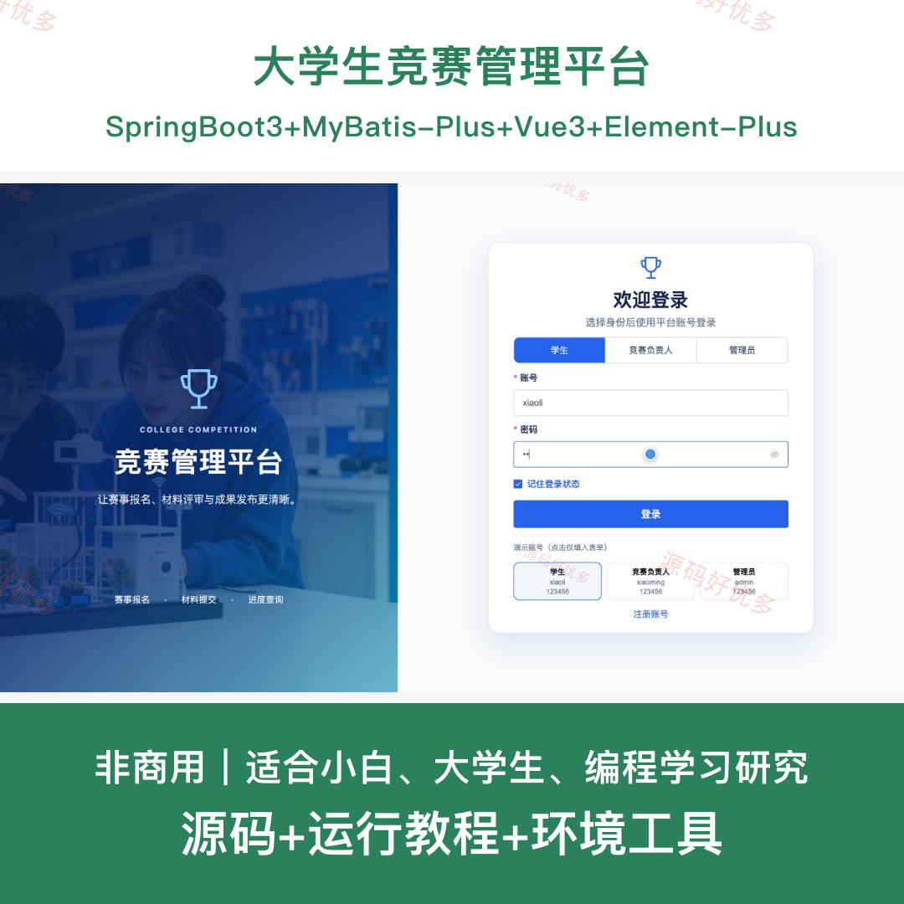
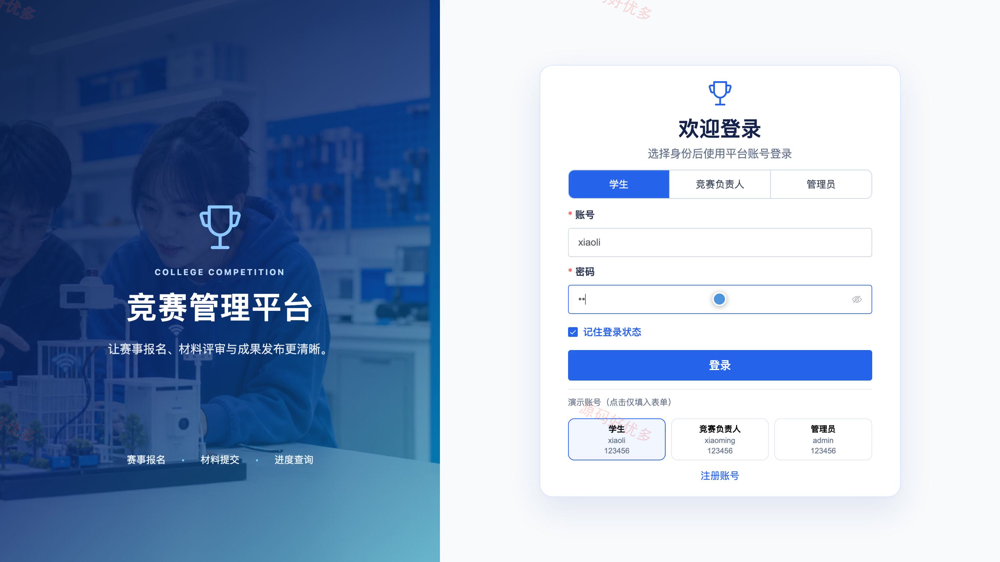
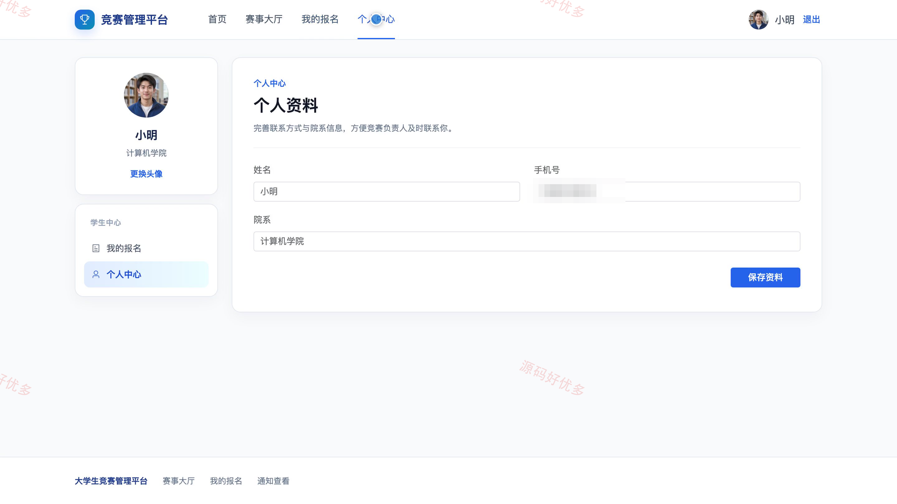
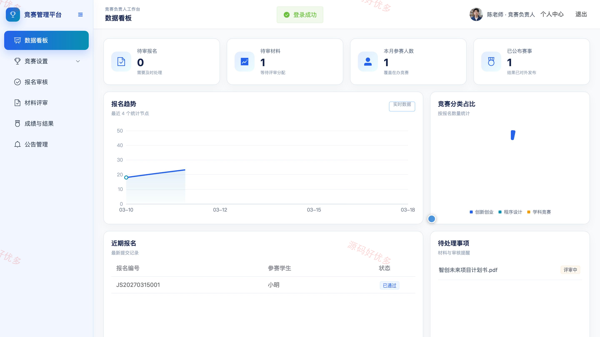
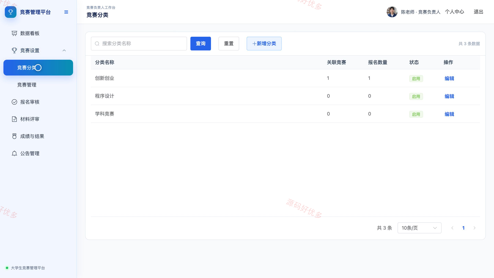
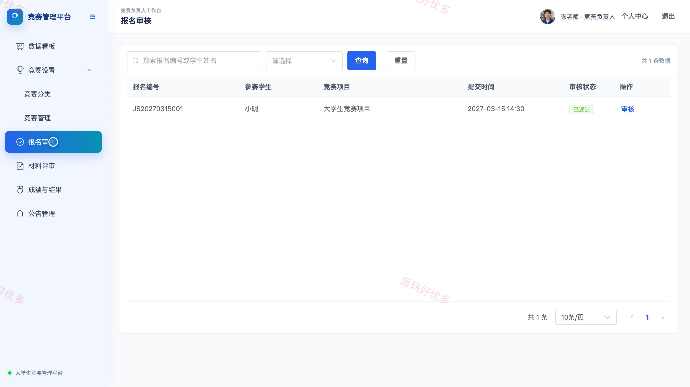
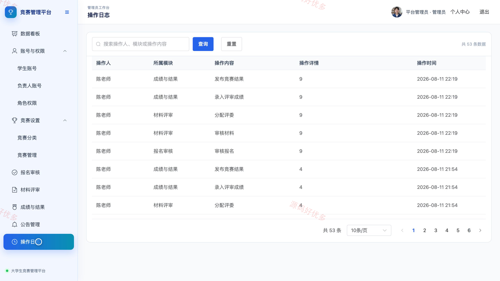

## 源码问题查看主页咨询

### 一、关键词
大学生竞赛、学科竞赛、竞赛报名、赛事管理、材料评审

### 二、作品包含
源码+数据库+全套环境和工具资源+本地部署教程

### 三、项目技术
前端技术： Html、Css、Js、Vue3.4、Element-Plus
后端技术：Java、SpringBoot3.2.0、MyBatis-Plus

### 四、运行环境（以下版本亲测，其他版本兼容性请自行测试）
开发工具：IDEA/eclipse + VSCODE

数据库：MySQL5.7+（共12张表）

数据库管理工具：Navicat10以上版本

环境配置软件： JDK17 + Maven

前端Nodejs：16+

浏览器：谷歌浏览器

### 五、项目介绍
项目编号：bs037A

本系统面向校园竞赛的发布、报名、材料提交、评审和结果公布全流程，为学生提供赛事浏览与参赛进度跟踪，为竞赛负责人和管理员提供审核、评审、成绩及运营数据管理能力。

角色：学生、竞赛负责人、管理员

学生功能：账号登录、赛事浏览与筛选、竞赛详情查看、在线报名与进度查看、参赛材料提交、竞赛结果与通知查看、个人资料维护。

竞赛负责人功能：竞赛数据看板、竞赛分类与信息管理、报名审核、参赛材料评审、成绩与结果管理、竞赛公告管理、个人资料维护。

管理员功能：竞赛数据看板、学生与负责人账号管理、角色权限管理、竞赛分类与竞赛管理、报名与材料审核、成绩结果及公告管理、操作日志查看、个人资料维护。

### 六、运行截图

